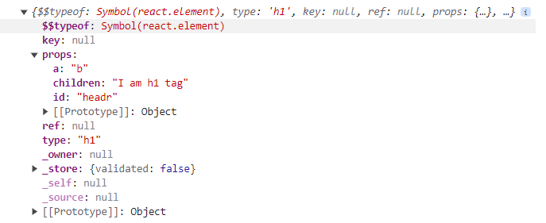
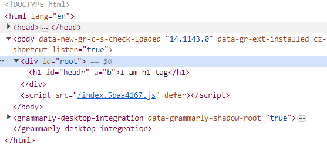
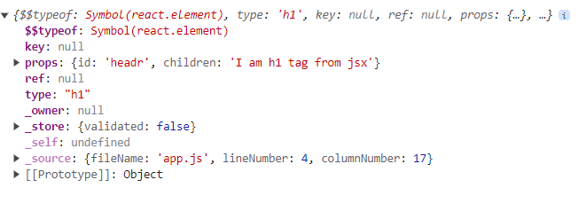
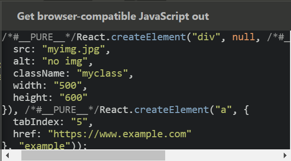
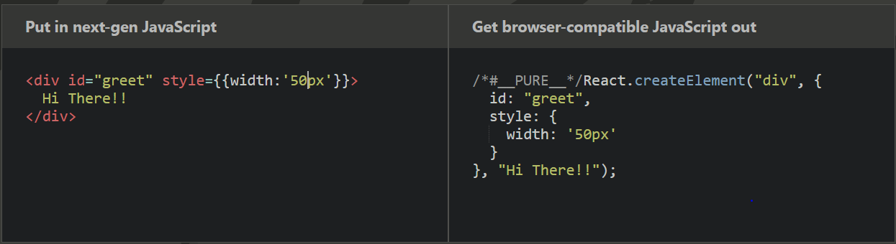
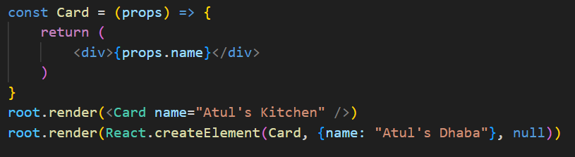
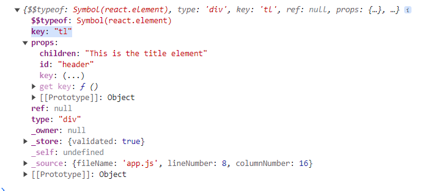
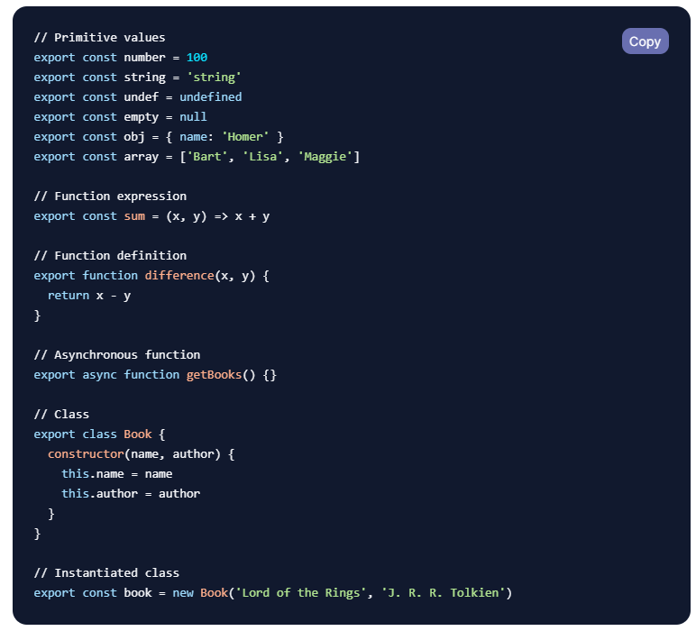

React will only work for the root element (the element we specify), thus its a library(working on small part of your code)

__npm__
- package.json is the configuration for npm
- ^1.1.1 indicates minor and patch version can change (<2.0.0)
- ~1.1.1 indicate on patch verssion can change (<1.2.0)
- [stackoverflow](https://stackoverflow.com/questions/22343224/whats-the-difference-between-tilde-and-caret-in-package-json)

- Every dependency in node_modules has its own package.josn
- The purpose of package-lock.json is to ensure that the same dependencies are installed consistently across different environments
- If package-lock.json is present, dependencies are installed from it
- We push package-lock.json for apllication to github
- Dependencies dont push their package-lock.json
- Node_modules are not pushed
- devDependencies doesn't go to production code (install with production flag)
- Anything in the script section can be run using `npm run`, start key doesn't need run, `npm start` will do

[__npx__](https://www.freecodecamp.org/news/npm-vs-npx-whats-the-difference/)

To execute a package with npm you either have to type the local path, like this:

`$ ./node_modules/.bin/your-package` 

like 

.`\node_modules\.bin\parcel .\index.html`
    
or you can run a locally installed package by adding it into your package.json file in the scripts section, like this:

    `{
        "name": "your-application",
        "version": "1.0.0",
        "scripts": {
            "your-package": "your-package"
        }
    }`

Then you can run the script using npm run:
    
`npm run your-package`

With npx

If you wish to execute a locally installed package, all you need to do is type:
    
`npx your-package`
    
npx will check whether _command_ or _package_ (node_modules .bin folder has commands scripts or binary packages) exists in $PATH, or in the local project binaries, and if so it will execute it.

Another major advantage is the ability to execute a package that wasn’t previously installed
    
`npx cowsay wow`

`npx create-react-app myproj`

check more on npx in this [freecodecamp blog](https://www.freecodecamp.org/news/npm-vs-npx-whats-the-difference/)

__modules__

- [Read this DigitalOcean blog on module completely](https://www.digitalocean.com/community/tutorials/understanding-modules-and-import-and-export-statements-in-javascript)
- ECMAScript 2015 supports the use of JavaScript modules.

- In order to ensure this code gets loaded as a module and not a regular script, add type="module" to the script tags in index.html. Any code that uses import or export must use this attribute

- Modules are different from regular scripts in a few ways:

    - Modules do not add anything to the global (window) scope.
    - Modules always are in strict mode.
    - Loading the same module twice in the same file will have no effect, as modules are only executed once.
    - Modules require a server environment.

**React** can be injected to our code by cdn links like below

    <body>
    <!-- top and bottom elements of root will not be replaced by react  --
    
    

 <!-- anything inside root will be replaced by react  -->
    
    
    
    

    
    </body>

This makes a network call to fetch the react scripts so not recommended

Another way is to use react as a dependency in our project

`npm i react`

`npm i react-dom`

in the app.js import react and react-dom. Since we are importing in app.js it should be decalred as module while sourcing in the html

    

__Pacrcel Bundler__

- Dev and Prod build
- Local server
- HMR (hot module reloading)
- File watch algo
- Caching
- Image Optimization
- Minification
- Code splitting
- Differential bundling for browser support
- Tree Shaking
- HTTPs
- Diagnostics

and a lot more, explore the [documentation](https://parceljs.org/docs/) for more

bundlers like parcel plays a key role in making our react app faster, performant and optimized

`npx parcel index.html` <--entrypoint

`npx parcel build index.html` <-- for prod build, need to remove the main field from package.json

We can add 

    "browserslist": [
       "last 2 versions"
    ]
 in the package.json and parcel build will take into account this list of browsers and our app will definately work on these browsers, explore [browserlist](https://github.com/browserslist/browserslist) for more

npm scripts convention

    "scripts": {
        "start": "parcel index.html",
        "build": "parcel build index.html",
        "test": "echo \"Error: no test specified\" && exit 1"
    },

    npm run start / npm start is for runnning in dev mode
    npm run build is for prod build

crossorigin tag 

Normal script elements pass minimal information to the window.onerror for scripts which do not pass the standard CORS checks. To allow error logging for sites which use a separate domain for static media, use this attribute. See CORS settings attributes for a more descriptive explanation of its valid arguments.

__React__

    const heading = React.createElement('h1', {"id": "headr", "a": "b"}, 'I am h1 tag')

    const root = ReactDOM.createRoot(document.getElementById('root'))

    root.render(heading)

React.createElement returns => obj => render() makes this an HTML element

createElement can take another reactElement as children

Object

HTML element

render will replace everything in the root element and not append

__jsx__

`const heading = <h1 id="headr">I am h1 tag from jsx</h1>`

This is not a valid js code. Browser will complain  `Unexpected token '<'`

But this html like syntax makes the coding easy for complex elements. This is called jsx and it returns the exact same reactElement that react.createElement() returns

But how does the browser understand jsx? 

It does because our code is transpiled to javascript before sending it to the browser. Bundler like Parcel does it with the help of Babel transpiler [check this out](https://babeljs.io/docs/#jsx-and-react)

[Read this article on creating an app with JSX only and not react](https://devsmitra.medium.com/react-how-to-create-the-app-using-jsx-without-react-cf5f0156568)

    JSX

    

    

    <a href="https://www.example.com">example</a>
    

Transpiled to 

Adjacent JSX elements must be wrapped in an enclosing tag also remember the camelCase of attributes

__Component__

Fuctional component: It is a normal javascript function that returns reactElement or in other words return JSX (because JSX gets transpiled to reactElement eventually). Function name indicating a component starts with capital letter

    const HeaderComponent = () => {
        return <h1 id="header">
                I am h1 tag from jsx
                

                    This is div
                

        </h1>
    }

    /* The jsx should start from same line as the retun keyword if not wrap it up in brackets () like below */

    const HeaderComponent = () => {
        return (
            <h1 id="header">
                    I am h1 tag from jsx
                    

                        This is div
                    

            </h1>
        )
    }

Use lowercase tags <lowercase/> when you need a DOM elements, and Capitalized tags <Capitalized/> for component elements.

Checkout the jsx syntax rules [here](https://medium.com/nerd-for-tech/jsx-rules-in-react-a-javascript-framework-4b0ab66fdbf9)

Rendering can happen in all the 3 ways below
    
    root.render(<HeaderComponent/>)
    root.render(React.createElement(HeaderComponent, {}, null))
    root.render(HeaderComponent())
    
    /* 1st gets transpilled to 2nd
    since ReactComponents are functions so 3rd one also works */

__Component Composition__

        const Title = () => 

            This is the title
        

        const HeaderComponent = () => {
            return (
                <h1 id="header">
                        <Title/>
                        I am h1 tag from jsx
                        

                            This is div
                        

                </h1>
            )
        }

In JSX we write javascript inside curly braces {}

        <h1 id="header"> 
                {title} # another reactElement or JSX
                {console.log("Hi")}
                {HeaderComponent()} # We can call functional component
                <HeaderComponent/> # renders the JSX returned from HeaderComponent, JSX understand component rendering so no need of {}

                {<HeaderComponent/>} JSX treats this like above, it means we can put JSX inside {}, if we have multiple components to render we need to wrap it up in a parent div

                <HeaderComponent></HeaderComponent>
                <Title/>
                I am h1 tag from jsx
                

                    This is div
                

        </h1>

For inline css the style attribute expects a js object

JSX by default protects from most of the XSS attacks as it sanitizes the javascript that we giveiin the curly braces
[read this](https://stackoverflow.com/questions/33644499/what-does-it-mean-when-they-say-react-is-xss-protected)

jsx converts the `<Card name="xyz">` to `React.createElement(Card, {name: 'xyz'})` and then react unerstands its Component as it starts wit capital letter and passes the 2nd and the 3rd paraments as arguements while calling the Card function, these are called props

[Check about config driven UI pattern, a industrial standard](https://www.arahansen.com/react-design-patterns-generating-user-configured-ui-using-the-visitor-pattern/)

Rendering an array of Components

    

        { [<Card id="1" />,<Card id="2" />, <Card id="3" />] }
    

    // This can also be done like below

    

        { [1,2,3].map(item => <Card key={item} id={item} />) }
    

ker and ref are special props and are not forwarded as props

Read this article on [special props](https://react.dev/warnings/special-props)

Since react uses key to identify the element uniquely and optimize its render cycle we shoulld always pass key to the component in array

Also index as key is an anti pattern see the articles [here](https://robinpokorny.com/blog/index-as-a-key-is-an-anti-pattern/) and [here](https://stackoverflow.com/questions/42773892/wrong-components-rendered-by-preact)

__Floder Structure__

Convention src > components > one_file_per_component
Read these articles to know the common approaches
[artcicle 1](https://blog.webdevsimplified.com/2022-07/react-folder-structure/),  [article2](https://legacy.reactjs.org/docs/faq-structure.html)

Generally name the File same as the component

Create a basic structure and as the app grows keep restructuring it

Named exports

`import { sum, difference, product, quotient } from './functions.js'`

Default exports

`export default function sum(x, y) {
  return x + y
}`

`import anyName from './functions.js'`

__Hooks__

Hooks are normal utilitu functions that react provides

    import { useState } from "react"
    const [variable, setVariable] = useState(0)
    setVariable(15)

When normal variable update re-rendering of component doesn't happen but when a state variable is updated react re-renders the component

React Keeps in sync the data layer(state vars) with the UI layer (what is displayed in UI)